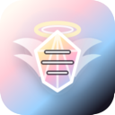
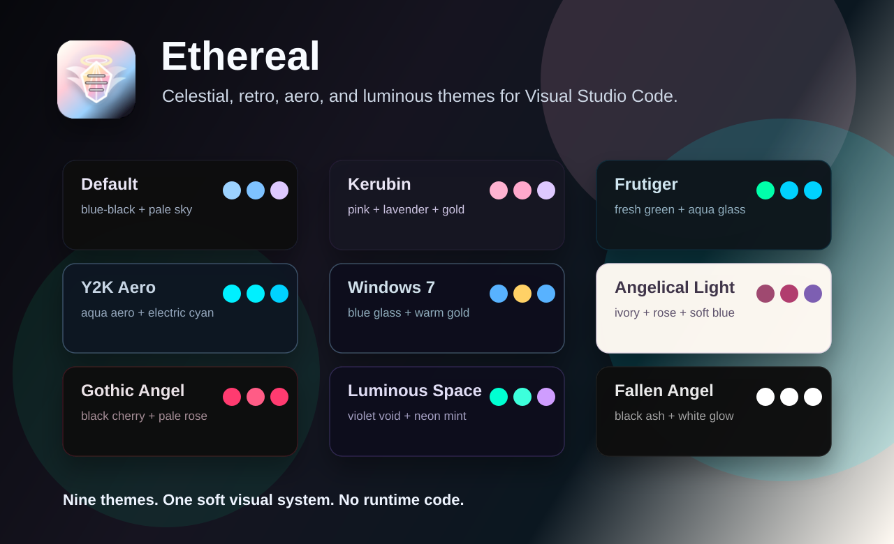
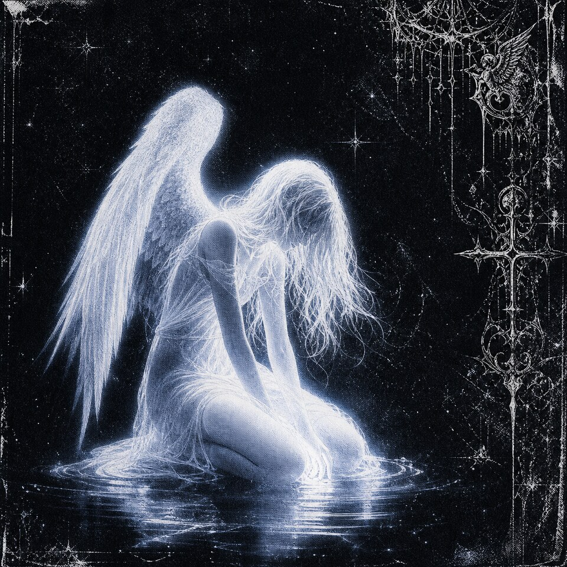
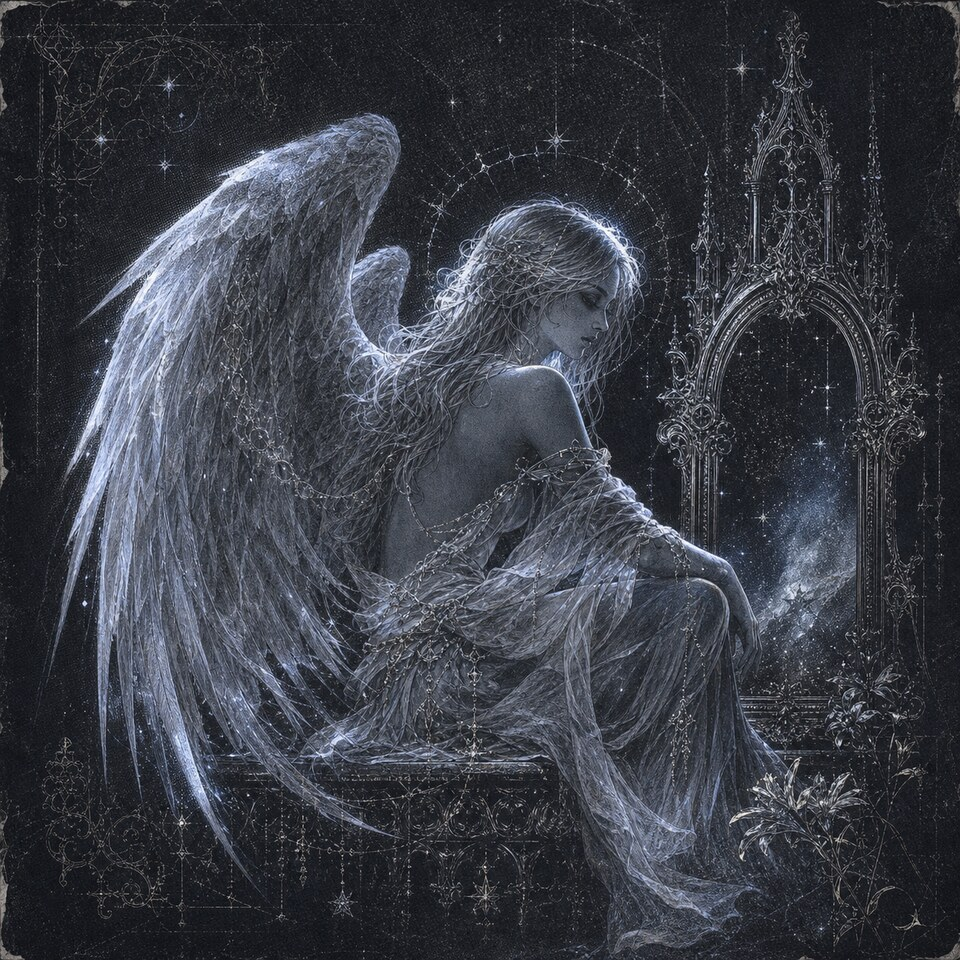

<p align="center">
  
</p>

<h1 align="center">Ethereal</h1>

<p align="center">
  A soft collection of celestial, retro, aero, and luminous color themes for Visual Studio Code.
</p>

<p align="center">
  <strong>Nine themes.</strong> One atmospheric visual system. No runtime code.
</p>

<p align="center">
  
</p>

## Atmosphere

Ethereal is shaped around a cold celestial mood: bright syntax, dark glass, soft bloom, and angelic monochrome texture. The collection now moves from glossy aqua nostalgia into gothic rose, luminous space, and fallen monochrome variants.

<p align="center">
  
</p>

## Themes

| Theme | Mood | Palette |
| --- | --- | --- |
| **Ethereal-Theme (Default)** | Deep blue-black surfaces with pale sky highlights. Calm, minimal, and made for long coding sessions. | `#07080c` `#9cd2ff` `#e2f1ff` |
| **Ethereal-Theme (Kerubin)** | A dusky cherubic palette with soft pink, lavender, mint, gold, and cyan syntax accents. | `#161420` `#ffb3d1` `#dec9ff` |
| **Ethereal-Theme (Frutiger)** | Fresh green and aqua highlights inspired by glossy Frutiger Aero interfaces. | `#08131a` `#00ffaa` `#00d2ff` |
| **Ethereal-Theme (Y2K Aero)** | Aqua glass over a translucent midnight base. Bright, playful, and glossy. | `#0b1720` `#00f0ff` `#00d2ff` |
| **Ethereal-Theme (Windows 7)** | Cool blue glass accents with warm gold highlights, inspired by classic desktop nostalgia. | `#0a111a` `#59b2ff` `#ffd166` |
| **Ethereal-Theme (Angelical Light)** | Warm ivory surfaces with readable rose, lavender, blue, mint, and gold syntax colors. | `#fffaf3` `#9f4a70` `#7d5fb2` |
| **Ethereal-Theme (Gothic Angel)** | Crimson gothic shadows with smoky rose highlights and pale chapel-glass text. | `#0f090b` `#ff3b70` `#ff5c86` |
| **Ethereal-Theme (Luminous Space)** | Deep violet space with mint starlight and soft cosmic contrast. | `#0d0b1a` `#00ffd2` `#cf9dff` |
| **Ethereal-Theme (Fallen Angel)** | Ash-black monochrome with white highlights and red warning accents. | `#080808` `#ffffff` `#ff6b6b` |

## Installation

1. Open **Extensions** in VS Code.
2. Search for **Ethereal**.
3. Install the extension.
4. Open **Preferences: Color Theme**.
5. Select any `Ethereal-Theme` variant.

You can also open the theme picker directly:

```text
Preferences: Color Theme
```

## Included Themes

```text
Ethereal-Theme (Default)
Ethereal-Theme (Kerubin)
Ethereal-Theme (Frutiger)
Ethereal-Theme (Y2K Aero)
Ethereal-Theme (Windows 7)
Ethereal-Theme (Angelical Light)
Ethereal-Theme (Gothic Angel)
Ethereal-Theme (Luminous Space)
Ethereal-Theme (Fallen Angel)
```

## Recommended Pairings

- Works well with soft icon themes and minimal UI chrome.
- The dark variants pair best with dim terminal backgrounds.
- Angelical Light is designed for bright environments while keeping syntax colors readable.

<p align="center">
  
</p>

## Notes

Ethereal contributes color themes only. It does not add commands, activate background code, or change editor behavior.

## License

See [LICENSE](LICENSE).
